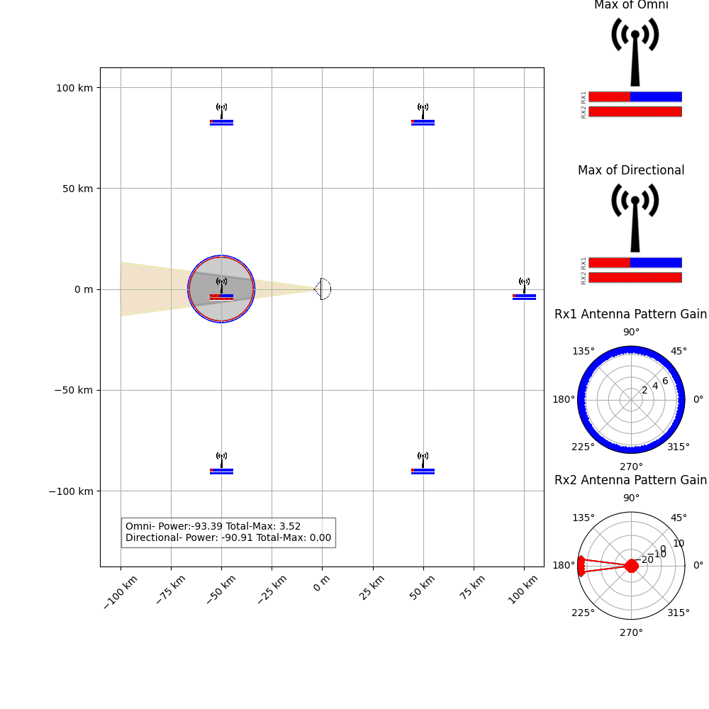

# los_simulation
A repository to model line-of-site power from one or more transmitters and receivers, includes antenna directivity. Based on the [friis](https://en.wikipedia.org/wiki/Friis_transmission_equation) equation. This repo is meant to calculate a 2D line of site power, it has tools for visualizing different scenarios. 

# Installation 
## Method 1 - Directly from Github
```shell
pip install git+https://github.com/sandersa-nist/los_simulation.git
```
## Method 2 - Clone then Install
1. Use your favorite way to clone the repo or download the zip file and extract it.  
2. pip install to that location (note pip expects a unix style string 'C:/los_simulation/')

```shell
pip install <path to top folder>
```
# Example Scenario
```python
from los_simulation import *
create_scenario_1()
```
# Typical Workflow
 1. Create one or more RxNodes with a set location, direction and antenna pattern
 2. Create one or more TxNodes with a set location, direction, antenna pattern and power
 3. Use node_to_node_power to calculate the friis equation for each node of interest.
 
 ```python
from los_simulation import *

frequency =3e9
rx = RxNode(location=[0,0],direction=[0,1],antenna_pattern=simple_directional_gain)
txs = []
number_transmitters =11
tx_distance = 1000
tx_angles = np.linspace(-np.pi,np.pi-2*np.pi/number_transmitters,number_transmitters)
for i,angle in enumerate(tx_angles):
    location = [tx_distance*np.cos(angle),tx_distance*np.sin(angle)]
    new_tx = TxNode(location=location,direction = [0,1],antenna_pattern = omni, power = -10, id=f"tx_{i}")
    txs.append(new_tx)
power_list_rx = np.array(list(map(lambda x: node_to_node_power(rx,x,wavelength=C/frequency),txs)))
total_power_rx = 10*np.log10(np.sum(10**(power_list_rx/10)))
print(f"All powers are {power_list_rx}")
print(f"The total power reaching the Rx is {total_power_rx}")
```
# [Jupyter Example](./examples/los_simulation_example.ipynb)
# [API Documentation](https://sandersa-nist.github.io/los_simulation/documentation/los_simulation.html)

